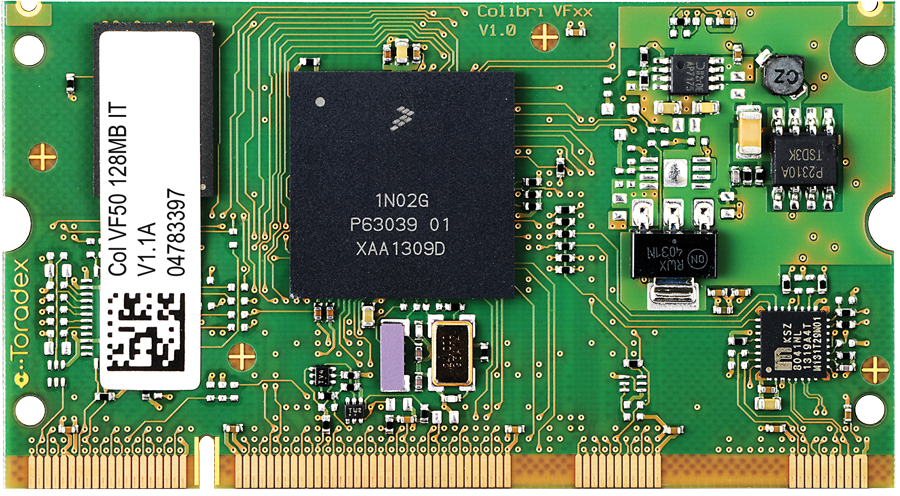
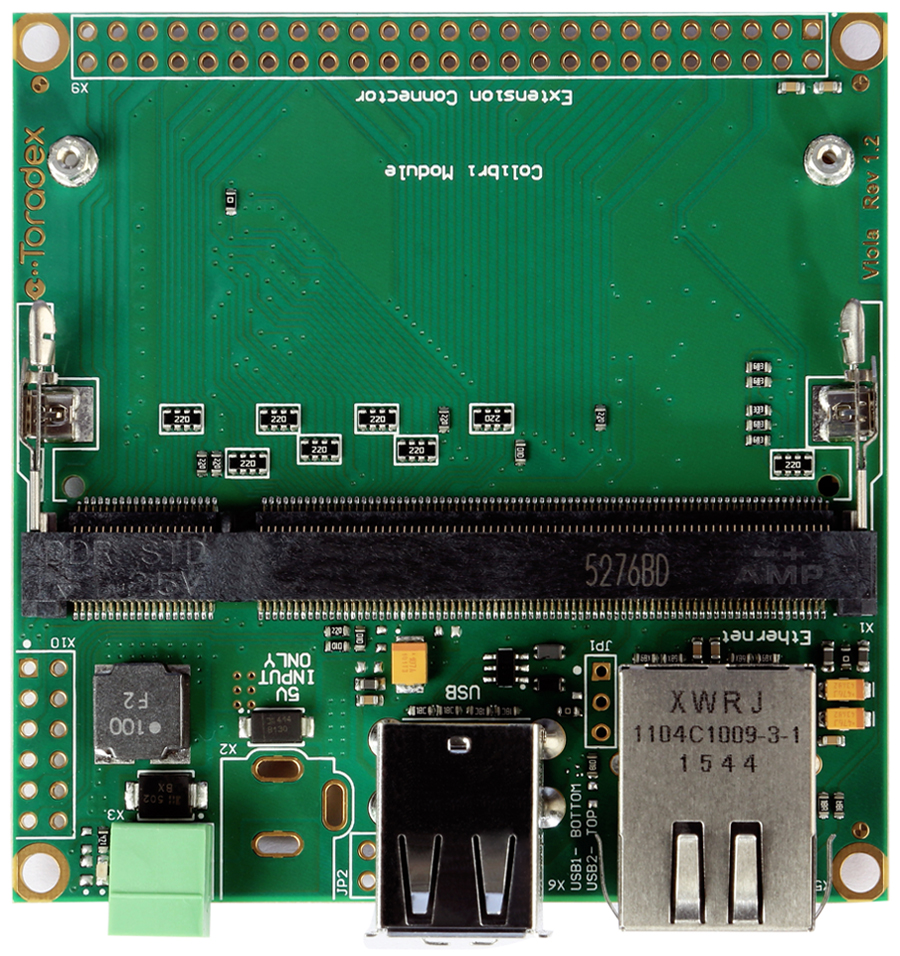
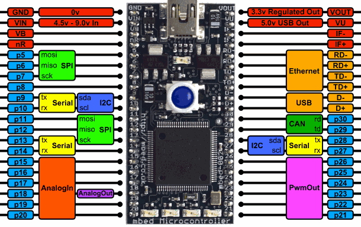
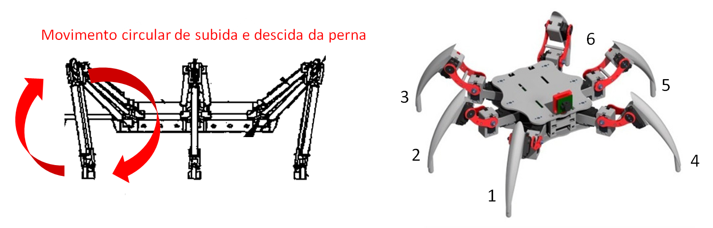
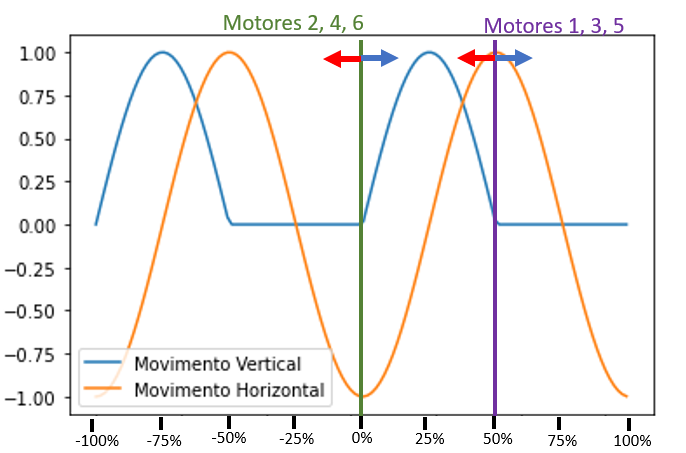
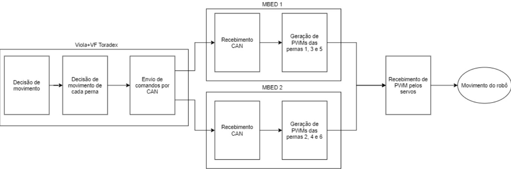

# FormigaMecatronica
Projeto final da matéria Sistemas Embarcados do primeiro semestre de 2021. Matéria ministrada pelo *Professor Doutor Glauco Augusto de Paula Caurin* do Departamento de Engenharia Aeronáutica e pelo *Professor Daniel Varela Magalhães* do Departamento de Engenharia Mecânica, ambos da Escola de Engenharia de São Carlos/Universidade de São Paulo.  

## Alunos/Desenvolvedores

* **[Felipe Catuta Pécora Finco](https://github.com/FelipeFinco)** *n° USP: 4822582* - *EESC/USP*
* **[Lucas Cortes Oliveira](https://github.com/colollucas)** *n° USP: 10309170* - *EESC/USP*
* **[Felipe Avelar Vaz de Oliveira](https://github.com/Felipe-Avelar-vaz)** *n° USP: 10308798* - *EESC/USP*

# Introdução

 Dentro da robótica, robôs hexapodes possuem uma ampla gama de utilização devido a sua habilidade de locomoção em terrenos acidentados, sendo utilizados principalmente em meios agrícolas, sendo empregado até mesmo em meios espaciais.

 Este trabalho consiste na implementação da lógica de movimentação do robô em um sistema de hardware já existente, o qual consiste em uma placa da Toradex (Colibri VF50 embarcada na Viola Carrier Board) que possui grande robustez, escalabilidade e compatibilidade com o Linux e duas MBEDs (com controlador LPC1768) para complementação devido seus recursos open source e modularização. A partir da saída PWM é possível controlar os 12 servo motores (2 servos por perna). Assim, pretende-se ao final do trabalho criar a lógica de movimento do robô na Toradex, esta envia comandos para ambas MBEDs que, por sua vez, devem estar aptas a interpretar esse comando e comandar os seus respectivos motores.
 
# Proposta
 Sabendo-se o contexto do projeto, devemos fechar seu escopo qual será a abordagem para os problemas expostos. Como imagina-se que o robô hexapode, aqui chamado de "formiga robótica", terá outras funcionalidades, pensaremos a estruturação do robô para que tanto o código, quanto o protocolo de comunicação seja versátil a adaptações e aprimoramentos.

 Assim buscamos fazer um software bem estruturado e comentado em inglês pensando que no futuro outras pessoas poderiam acessá-lo. Para abordar os protocolos de comunicação, usa-se PWM para informar as posições dos servos como padrão e escolhemos o protocolo CAN para realizar a comunicação entre os processadores. Este protocolo foi selecionado apesar de não ser tão facilmente implementável pois é um protocolo que possui uma robustez muito grande, além de ser determinístico e permitir que eventualmente outros dispositivos sejam "pendurados" na mesma rede. Como imagina-se o uso desse protocolo para outros sistemas, buscamos fazer a comunicação o mais eficiente possível e não necessariamente da forma mais simples.

 Para tal, buscou-se caracterizar o movimento dos motores pelo menor número de variáveis através da integração do movimento das pernas, uma vez que se imagina, para movimentos simples, o motor vertical e horizontal da mesma perna atrelados entre si, dá para reduzir o número de graus de liberdade. Toda esta lógica de movimentação foi feita na Toradex para que poucas mensagens fossem passadas para a MBED, sendo cargo desta processá-las e criar por conta o sinal de movimentação do motor. 

 # Entendendo o Sistema
 
 Para essa implementação, foi utilizada a placa Colibri VF50, um computador em módulo com CPU Cortex A5 de limite de processamento de 400MHz, que se destaca principalmente pelo seu custo benefício, por ter diversas capabilidades que possibilitam uma ampla gama de aplicações, incluindo equipamentos de IHM e dispositivos industriais, equipamentos de segurança, infraestrutura e manufatura, aplicações de conversão de energia como drivers e inversores de frequência, dispositivos robustos de conectividade e sistemas operados por bateria como robôs e veículos industriais.

     
Esse computador está embarcado em uma placa de suporte chamada Viola Carrier Board, uma single-board computer (SBC) de 74x74mm, que apresenta suporte a diferentes interfaces utilizadas no mercado, sendo importante para a comunicação CAN que será utilizada no projeto.

     
Para enviar os sinais em PWM, foram usadas as MBED da LPC 1768, que pode ser vista abaixo.

     
     
Como pode ser visto na imagem do pinout da placa, ela é desenvolvida para a prototipagem de diversos tipos de dispositivos, tendo múltiplas entradas e saídas, de acordo com a aplicação. Para este projeto, utilizamos portanto as portas de saída com sinal PWM e as de comunicação CAN. Esse protocolo foi utilizado por sua robustez, facilidade de se adaptar a condições de falha e fácil debugging.

# Desenvolvimento
## Desenvolvimento da Lógica
Tendo em vista a proposta do protótipo o movimento de formigas foi observado a fim de formular uma lei de integração entre as pernas. Os movimentos das patas fora pensados para serem semi-circulares e em 180° de fase entre as patas ímpares em relação às pares. Assim, em um movimento para frente por exemplo, enquantos as patas pares vão estar levantando e se movendo para frente, as ímpares vão estar em contato com o soloe empurrando o chão para trás. Se descrevermos esse movimento de cada perna pelas suas componentes longitudinais e verticais, vai resultar no gráfico a seguir, sendo que movimento para frente da formiga é representado seta pra direita azul e movimentos para trás são representados pela seta para a esquerda vermelha. Assim, o movimento dos dois serovos da perna são realizados por apenas uma variável, diminuindo assim o tamanho da mensagem que precisa ser enviada (precisando ser enviadas 6 mensagens e não 12).

  
É interessante, na visão de sistema, que toda a decisão de trajetória seja feita por um sistema apenas, que no caso seria a Toradex, pois isso além de garantir a sincronização dos movimentos, facilita desenvolvimentos futuros em que o calculo de trajetória pode estar associada à leitura de sensores e todos os sinais deveriam ser enviados para as duas MBEDs. Assim, a Toradex recebe o movimento desejado pelo usuário, o que permite decidir qual movimento cada perna do robô deve executar para realizar esse movimento e então ela envia para as MBEDs qual fase e qual sentido deve ir cada perna para realizar o movimento. Assim, a MBED, depois de receber a mensagem da Toradex, começa a desenvolver o movimento sozinha das suas pernas até acabar um ciclo completo do movimento.

Nos dois códigos, para facilitar a comunicação entre os módulos, utilizou-se de máquina de estados para visualizar mais claramente as etapas da comunicação entre usuário e Toradex, e entre Toradex e MBED. Os diagramas da Toradex e da MBED estão expostos abaixo, explicando mais claramente quais estados cada dispositivo envolvido no processo de caminhada da Formiga pode assumir. 

Para a Toradex, temos 3 estados: 
-"SENDING_COMMAND", que é o estado inicial e recebe as orirentações do usuário a respeito da movimentação da formiga desejada e, tendo entendido a mensagem, transmite esse sinal  e encaminha o sistema para a finalização tendo sido já performado o movimento desejado;
-"WAITING_MOVEMENT", que recebe o sinal de movimentação desejado e recebe o sinal de completude desse movimento;
-"EXIT", que é o estado de finalização.

 
     

 Na MBED, mais simples, temos dois estados: "WAITING_COMMAND", que recebe o sinal da Toradex e "SENDING_MOVEMENT", que executa e sinaliza o fim do movimento.  
     
   

## Desenvolvimento do Código

Como proposto, o código foi pensado para ser estruturado para facilitar a leitura e modificação, por isso foi adotado uma máquina de estados para ambas plataformas como mencionado anteriormente. Essas máquinas de estados foram feitas utilizando-se de Switch Cases dos estados mencionados no tópico anterior.

Além disso, o código foi sendo escrito comentando-se suas funções principais e onde poderia haver dúvidas para algum novo usuário que precisaria entendê-lo para aprimorar ou debugá-lo. No desenvolvimento do código foi utilizado bastante de printf() para entender seu funcionamento como ferramenta de debug.

A ferramenta de diretiva foi muito utilizada, pois, como havia bastante dificuldade na implementação da rede CAN e precisava-se testar o código, definiu-se (ou não) uma variável chamada “SEND_BY_CAN”. No código da Toradex, quando essa variável estava definida fazia com que a escrita da mensagem da mensagem fosse feito por um socket CAN, e quando não estava definida, a mensagem era então printada na tela. Já no código da MBED, a definição dessa mesma variável fazia com que o código esperasse o recebimento da mensagem por CAN, ou, quando não definida, esperava o recebimento por scanf. Além disso, outra diretiva importante usada foi a para dizer para qual das duas MBEDs estava sendo compilado o código, bastando definir a variável “ODD_LEGS_MBED” caso a MBED seria a que controla as pernas 1, 3 e 5 ou “EVEN_LEGS_MBED” caso fosse a MBED que controla os motores 2, 4 e 6.

Um desafio do código foi conseguir construir a mensagem de comunicação entre os sistemas de forma eficiente. Para que isso fosse possível, foi reduzido o número de variáveis, como explicado no capítulo anterior e também precisou-se comprimir os bits de informação para que fosse enviado junto com a string da mensagem da CAN, como será melhor explicado no próximo capítulo. Para fazer essa manipulação de caracteres, foi preciso fazer operações “bitwise” e entender cada caractere como 8 bits para enviar as mensagens.

O processo de desenvolvimento do código foi feito no computador dos integrantes do grupo de forma remota utilizando o Visual Studio Code. Acessomos o computador do laboratório através do AnyDesk e utilizamos este repositório para acessar os códigos feitos no computador pessoal e poder testá-los nas placas. O próprio processo de build, importação do binário na placa e boot do programa não é algo simples para novos usuários e por isso criamos o .txt deste repositório chamado “compilando_e_enviando”. Nele explica como realizar o processo de cross compile no Linux do programa da Toradex (explica depois da primeira vez que já colocamos para funcionar) e enviar o binário para a VF50. Além disso, explica a buildar o programa na IDE online da MBED e passar o arquivo binário para a MBED e reiniciá-la utilizando o GTKTerm.

## Desenvolvimento da Comunicação

Para a comunicação, como exposto, utilizamos o protocolo CAN. O pacote de dados enviado na mensagem consistia basicamente em uma palavra de cinco caracteres. Cada caractere era um byte, sendo portanto uma palavra um número composto de 40 bits. Essas palavras eram geradas no código que estava na Toradex, a mensagem era transmitida para a MBED e então traduzida e executada, de modo que, para a perna efetuar uma ação, ela precisa basicamente de duas informações, isto é, a fase (0° ou 180°) e o sentido (para frente ou para trás). Sendo assim, para as seis pernas, são necessários pelo menos 12 bits dentre os 40 que são transmitidos a cada instante, como pode ser visto na imagem.

  

Dessa forma, idealmente, ao receber e traduzir a mensagem, a MBED receberia o comando feito pelo usuário e executaria o movimento desejado. 

Com base no site https://developer.toradex.com/knowledge-base/build-u-boot-and-linux-kernel-from-source-code#tab-colibri-vfxx,  para ter acesso à porta CAN da placa, foi necessário acessar e reprogramar a device tree, reconstruindo-a com a tool chain apropriada, enviando essa nova device tree para a Toradex utilizando um cartão SD e bootando ela em modo de configuração, recompilando o Kernel. Quando a comunicação ia ser executada, porém, o sistema apresentava um erro em que aparecia que a porta desejada não pôde ser encontrada no dispositivo.  

  
     
Caso a mensagem seja recebida e enviada diretamente do terminal, tanto a Toradex quanto a MBED captam e conseguem traduzir a mensagem, e no caso da MBED, executar o comando devido. Esse erro detalhado acima aconteece, porém, quando há a tentativa de estabelecer comunicação direta entre as duas placas.  
     
 
     

# Conclusão

Conseguimos ao final do projeto desenvolver, compilar e enviar o programa para ambas as plataformas. Procurou-se que estes programas fossem bem estruturados e com uma lógica com um certo nível de complexidade para ser eficiente no envio e recebimento de mensagens. Como não foi possível fazer o protocolo CAN funcionar no hardware disponível, a única forma em que encontramos para realizar a comunicação com as placas foi através do uso de printf e scanf, em que nós fazíamos o envio na mão das strings via terminal. Para fins acadêmicos, o propósito de criar familiaridade no desenvolvimento de softwares embarcados foi alcançado, utilizando para isso plataformas Linux e Git, entre outros assuntos aprendidos na matéria.

